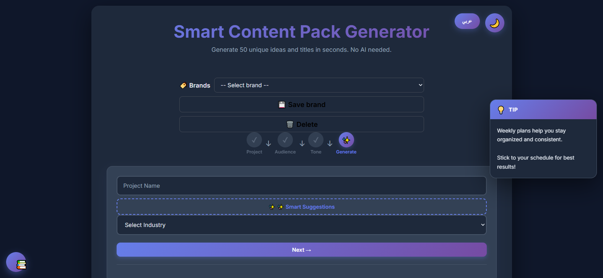
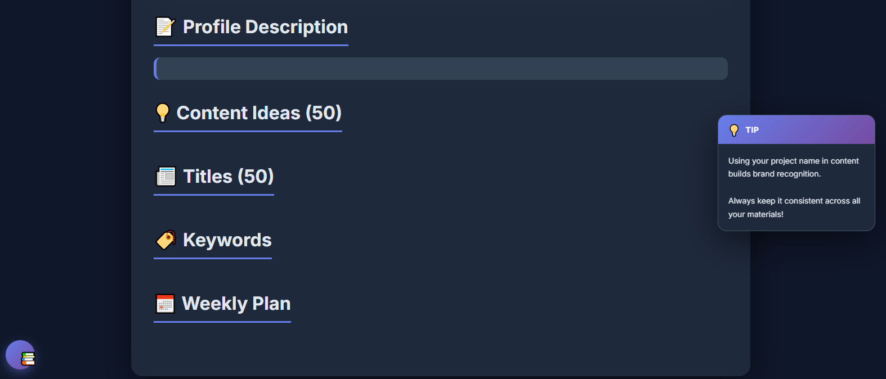
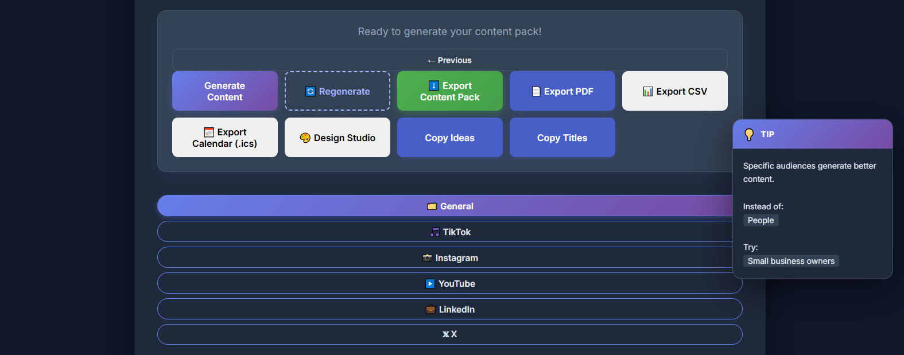

<div align="center">

# 🚀 Smart Content Pack Generator
### مولّد حزم المحتوى الذكي — النسخة التجريبية (Demo)

**From blank page to a full month of content — in seconds.**
**من الصفحة الفارغة إلى شهر كامل من المحتوى — في ثوانٍ.**

[]()
[]()
[]()
[]()

[🛒 **اشترِ النسخة الكاملة — Buy the Full Version**](https://payhip.com/b/4i7zY)

</div>

---

> ⚠️ **هذا مستودع عرض فقط (Demo)** — يحتوي على لقطات شاشة ووصف للمنتج.
> **الكود المصدري الكامل يُباع حصرياً عبر:** 👉 [payhip.com/b/4i7zY](https://payhip.com/b/4i7zY)
>
> This is a showcase-only repository. The full source code is sold exclusively through Payhip.

---

## 🖼️ لقطات من الأداة

### الصفحة الرئيسية — توليد الحزمة كاملة


### التقويم الشهري التفاعلي — اسحب أفكارك إلى الأيام


### التصدير والاستوديو — TXT · PDF · CSV · ICS · بريف تصميم


---

## ✨ ماذا ستحصل عليه؟

| | الميزة | القيمة لك |
|---|--------|-----------|
| 🎯 | **50 فكرة + 50 عنواناً** | مساحة ضخمة تختلف كل ضغطة، والأفكار المحذوفة لا تعود |
| 🌍 | **عربي أصيل + إنجليزي** | قوالب مصممة لكل لغة على حدة مع دعم RTL كامل |
| 📱 | **حزم 5 منصات** | TikTok · Instagram · YouTube · LinkedIn · X بأسلوب كل منصة |
| #️⃣ | **هاشتاقات ثلاثية الطبقات** | وصول واسع / متوسط / استهداف دقيق |
| 📅 | **تقويم شهري تفاعلي** | اسحب أو اكتب، ويُصدَّر إلى Google Calendar / Outlook |
| 🏷️ | **ملفات العلامات** | بدّل بين مشاريعك بنقرة واحدة |
| 📚 | **مكتبة صيغ** | هوكات فيروسية وCTAs جاهزة للنسخ |
| 🎨 | **استوديو التصميم** | لوحة ألوان + خطوط + مقاسات المنصات = بريف جاهز لمصممك |
| 🖼️ | **برومبتات صور AI** | 9 برومبتات جاهزة بجميع النسب لأدوات توليد الصور |
| 🤖 | **مساعد AI اختياري** | OpenAI / Groq / OpenRouter / Ollama المحلي المجاني |
| 📤 | **تصدير شامل** | TXT · PDF · CSV · ICS + أزرار نسخ لكل شيء |

🔒 **خصوصية كاملة**: كل شيء يعمل محلياً في المتصفح — لا حسابات، لا خوادم، ومفاتيح API تبقى في جهازك.

---

## 💻 كيف تعمل؟

```
1️⃣ اسم المشروع + المجال   →   2️⃣ الجمهور   →   3️⃣ النبرة   →   4️⃣ ✨ ولّد!
```

بدون تنصيب. بدون إنترنت إلزامي*. ملف واحد يفتح مباشرة في متصفحك.
<sub>*إنترنت needed فقط لتصدير PDF وميزة AI الاختيارية.</sub>

---

## 🛒 اشترِ النسخة الكاملة

<div align="center">

### 👇 كل ما تحتاجه في صفحة واحدة 👇

# [**payhip.com/b/4i7zY**](https://payhip.com/b/4i7zY)

دفع آمن · تحميل فوري بعد الشراء · تفاصيل أكثر في [BUY.md](BUY.md)

</div>

### ماذا يصل بريدك بعد الشراء؟

```
ContentPackGenerator/
├── index.html            ← الواجهة كاملة
├── style.css             ← ثيم فاتح/داكن + RTL
├── data.js + data/       ← 4 مجالات جاهزة × لغتين
├── server.js             ← خادم محلي اختياري
├── js/
│   ├── engine.js         ← محرك التنويع والاستبعاد
│   ├── platforms.js      ← حزم المنصات الخمس
│   ├── calendar.js       ← التقويم التفاعلي
│   ├── studio.js         ← البريف + البرومبتات + AI
│   ├── formulas.js       ← مكتبة الصيغ
│   ├── i18n.js           ← نظام الترجمة
│   ├── exporters.js      ← TXT/PDF/CSV/ICS
│   └── storage.js        ← الحفظ المحلي
└── tools/                ← بناء البيانات + 156 اختباراً
```

✅ ترخيص استخدام شخصي وتجاري لمشاريعك • ✅ تحديثات مستقبلية • ✅ يعمل offline للأبد

---

## ❓ أسئلة سريعة

<details>
<summary><b>هل أحتاج إنترنت؟</b></summary>
لا — التوليد والتقويم والتصديرات تعمل offline بالكامل. الإنترنت يُطلب فقط لتصدير PDF وميزة AI الاختيارية.
</details>

<details>
<summary><b>هل أحتاج مفتاح AI؟</b></summary>
إطلاقاً — الأداة مصممة للعمل بدون ذكاء اصطناعي. ميزة AI اختيارية تماماً لمن يريد توسيع النتائج بمفتاحه الخاص.
</details>

<details>
<summary><b>عربي أم إنجليزي؟</b></summary>
كلاهما بنقرة واحدة — وقوالب العربية أصيلة مكتوبة خصيصاً، وليست ترجمة آلية.
</details>

<details>
<summary><b>هل يمكنني استخدامه تجارياً؟</b></summary>
نعم — استخدم المخرجات في مشاريعك وعملائك بحرية. تفاصيل الرخّص في <a href="BUY.md">BUY.md</a>.
</details>

---

## 🌍 English

**Smart Content Pack Generator** turns a blank page into a complete content month: 50 ideas, 50 titles, tiered hashtags, a weekly plan, an interactive calendar, platform-specific packs (TikTok/Instagram/YouTube/LinkedIn/X), and a designer-ready brief with auto palettes and image prompts. 100% local & private, truly bilingual EN/AR with native RTL, zero dependencies, and optional AI via your own key (free Ollama mode included).

This repo is **demo-only** (screenshots). Get the full source at **[payhip.com/b/4i7zY](https://payhip.com/b/4i7zY)** — secure checkout, instant download. See [BUY.md](BUY.md) for what's included and licensing.

<div align="center">

Made with ❤️ for content creators — everywhere, in every language.

</div>
